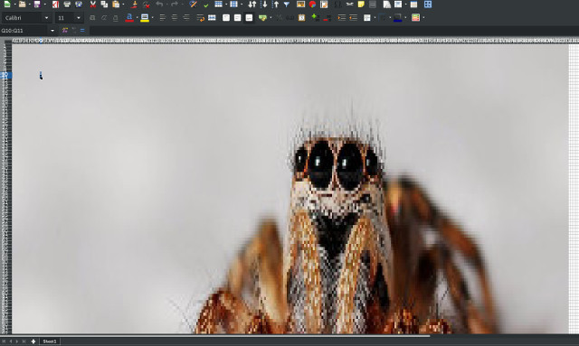

People are sharing screenshots in word documents.
Therefore I share pictures as excel shit.



# History

I was complaining on IRC about someone sending me a screenshot as a word file. 
Then my friend **Aaron Lav** had a comment that I turned into that project:

<asl2> much rarer to encode screenshots in excel with a cell per pixel

## Even more history

It turns out that someone had that idea already: http://think-maths.co.uk/spreadsheet   (thanks [sphereinabox](http://sphereinabox.wordpress.com/))

# Usage

It probably works with any python.

To install dependencies, run:

$ pip install -r requirements.txt

```
python conv picture.jpg picture.xlsx
```

Careful, the output files look small, but they may take a while to open.
